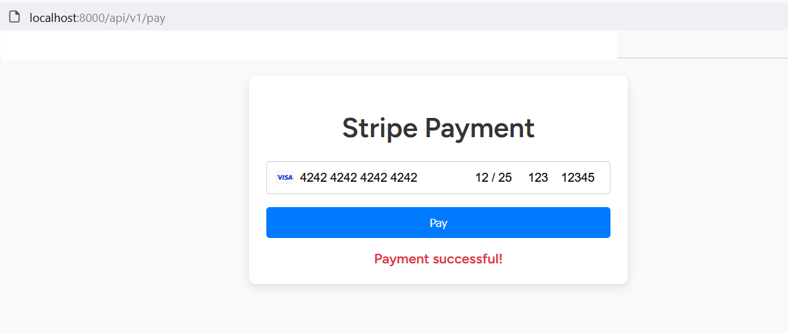

# Payment and Order Management System

This project is a Laravel-based API for managing orders and payments, integrated with the Stripe payment gateway.

## Features
- Create, update, and retrieve orders.
- Process payments using the Stripe payment gateway.
- Webhook to handle payment status updates (successful/failed payments).
- JWT-based authentication and role-based access control (RBAC).
- Security features like rate-limiting, data validation, and adherence to PCI DSS standards.

## Requirements
- PHP 8.x
- Composer
- Laravel 10.x
- Stripe API keys

## Setup Instructions

### Step 1: Clone the repository
```bash
git clone https://github.com/rashaatta/payment-order-system.git
cd payment-order-system
```

### Step 2: Install dependencies
```bash
composer install
```

### Step 3: Set up environment variables
1. Copy the `.env.example` to `.env`:
    ```bash
    cp .env.example .env
    ```
2. Update the following environment variables in your `.env` file:
    ```bash
    APP_NAME=PaymentOrderSystem
    APP_ENV=local
    APP_KEY=base64:...
    APP_DEBUG=true
    APP_URL=http://localhost

    DB_CONNECTION=mysql
    DB_HOST=127.0.0.1
    DB_PORT=3306
    DB_DATABASE=your_database
    DB_USERNAME=your_username
    DB_PASSWORD=your_password

    STRIPE_KEY=your_stripe_public_key
    STRIPE_SECRET=your_stripe_secret_key
    ```

### Step 4: Generate application key
```bash
php artisan key:generate
```

### Step 5: Run database migrations
```bash
php artisan migrate
```

### Step 6: Start the local development server
```bash
php artisan serve
```

The API will now be running at `http://127.0.0.1:8000`.

## Payment Gateway Integration (Stripe)

This application integrates with the Stripe payment gateway. You need to provide your Stripe API keys in the `.env` file.

### Payment Flow
1. User places an order with product details (Product Name, Quantity, Price).
2. Payment is processed via Stripe when the order is created.
3. Stripe webhook updates the order status based on payment success or failure.

### Webhook Setup
To receive payment updates from Stripe, set up a webhook in your Stripe Dashboard to point to:
```
http://yourdomain.com/api/v1//payment/webhook
```
## Payment Form
```
http://localhost:8000/api/v1/pay
```
Here is a preview of the payment form that the user interacts with:




Make sure to handle this in production by securing the endpoint and verifying the webhook signature.

## API Documentation
- You can explore the API endpoints using Postman or Swagger.
- A Postman collection is included in the repository under `postman_collection.json`.

### Endpoints:
- `POST /api/v1/orders`: Create an order.
- `GET /api/v1/orders`: Get a list of orders.
- `PATCH /api/v1/orders/{id}`: Update an order's status.
- `POST /api/v1/orders/27/pay`: Process payments.

Authentication is required for all API endpoints, using JWT tokens.

## Running Tests

To run the test suite, use:
```bash
php artisan test
```
 
## Security

- API endpoints are secured with JWT authentication. 
## Postman Collection

To test the API endpoints, you can import the Postman collection provided in the project. Follow the steps below:

1. Download the Postman collection file: [Postman Collection](payment-order-system.postman_collection.json)
2. Open Postman, go to "Collections" on the left-hand side, and click "Import."
3. Upload the `payment-order-system.postman_collection.json` file
